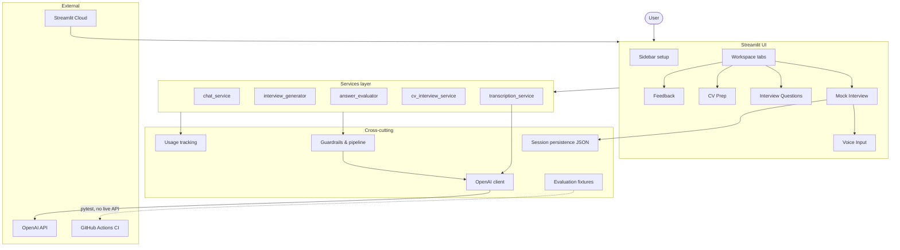
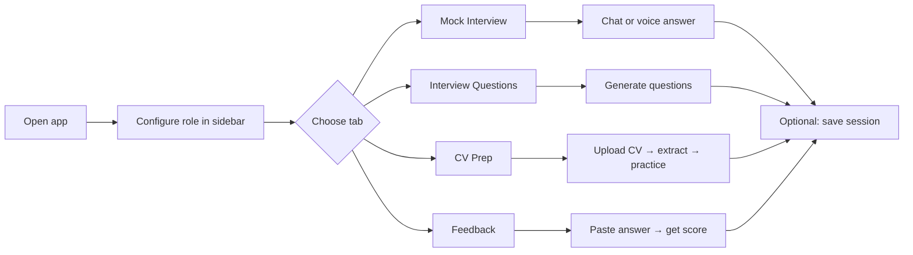
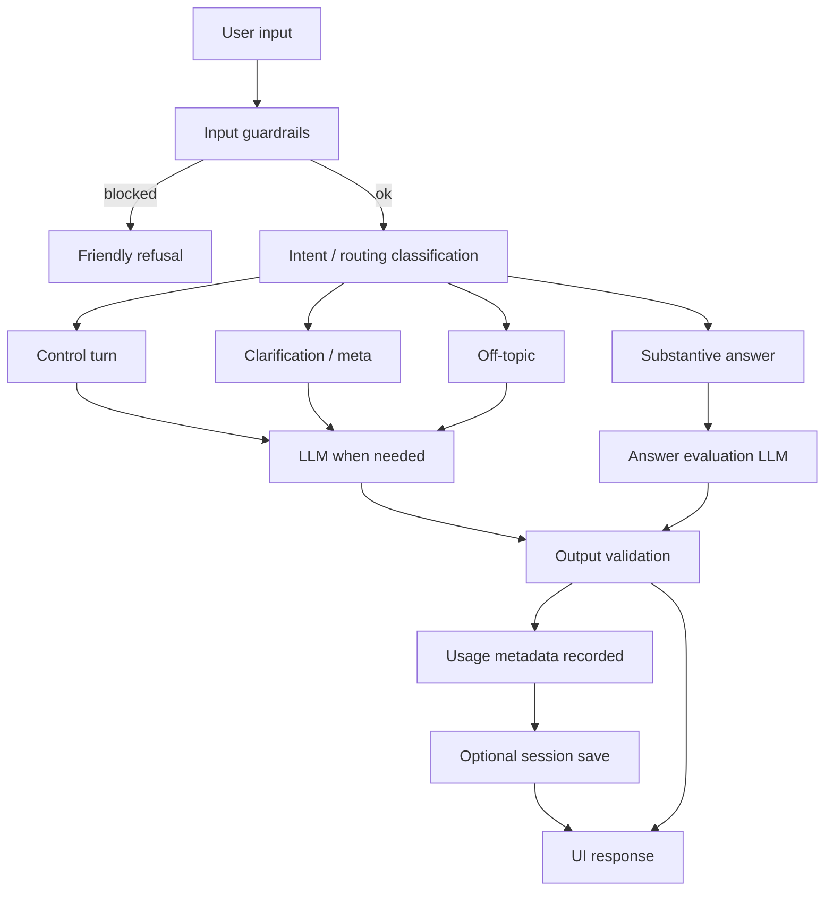
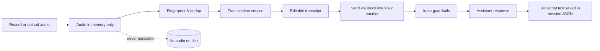
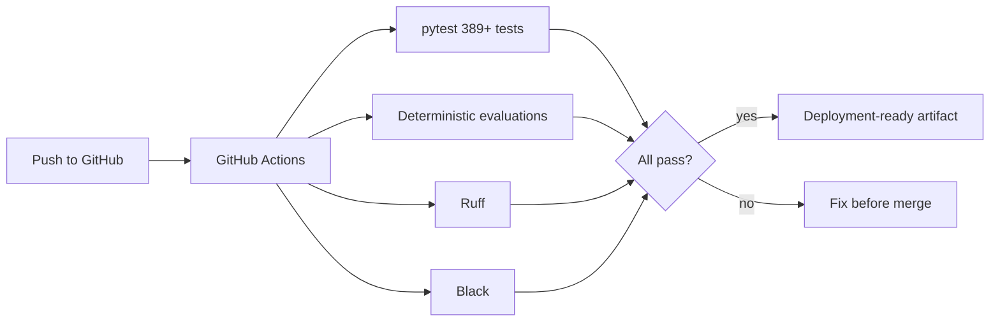

# AI Interview Preparation Assistant

**An AI-powered interview coaching app** that helps candidates prepare through mock interviews, role-specific questions, CV-based preparation, voice input, structured feedback, guardrails, usage visibility, deterministic evaluation tests, CI, and Streamlit Cloud deployment.

Built as a **portfolio / bootcamp project** with production-minded engineering practices—not a toy chatbot.

| | |
|---|---|
| **Live demo** | [ai-interview-preparation-assistant.streamlit.app](https://ai-interview-preparation-assistant-tjgyh9egbtxrkk67cmcgu.streamlit.app) |
| **Repository** | [github.com/Fejjii/AI-Interview-Preparation-Assistant](https://github.com/Fejjii/AI-Interview-Preparation-Assistant) |
| **Status** | Feature-frozen · deployed on Streamlit Cloud · CI green |

---

## Screenshots

_Add PNG captures under `docs/screenshots/` and they will render here._

| Mock Interview | Interview Questions |
|:---:|:---:|
|  |  |

| CV Prep | Feedback |
|:---:|:---:|
|  |  |

See [docs/screenshots/README.md](docs/screenshots/README.md) for suggested captures.

---

## Why I built this

Interview preparation is often **generic, passive, and not personalized enough**. Candidates practice with static question lists, get little structured feedback, and rarely rehearse in a flow that mirrors a real interviewer's turns—clarifications, follow-ups, and role-specific depth.

This project applies **applied LLM product thinking** to a focused coaching workflow: configure your target role once, practice in a mock interview, generate tailored questions, prepare from your CV, and receive scored feedback—with guardrails, usage limits, and tests that keep the system reliable enough to demo publicly.

---

## Key features

| Feature | Description |
|---------|-------------|
| **AI mock interview** | Chat-style practice with deterministic turn routing (start, control, clarification, off-topic, answer) and evaluation only on substantive answers |
| **Role-specific question generation** | Questions calibrated to category, seniority, round, focus, and optional job description |
| **CV-based interview preparation** | PDF/DOCX upload → structured extraction → grounded practice or full-prep question sets |
| **Structured answer feedback** | Markdown-parsed scores, strengths, gaps, model answers, and follow-up questions |
| **Voice input (speech-to-text)** | Record or upload audio in Mock Interview → transcribe → edit → send through the normal chat handler |
| **Streaming responses** | Progressive tokens for selected conversational mock-interview turns (`ENABLE_STREAMING`) |
| **Guardrails** | Prompt-injection heuristics, secrets/config exfiltration blocking, CV delimiter sanitization, moderation, rate limits, output validation |
| **Demo usage limits** | Per-browser-session LLM call cap in Demo mode; BYO key mode unlimited |
| **Usage metadata** | Token counts, latency, and rough USD estimates on LLM responses |
| **Saved sessions** | Local JSON persistence (text only; scoped by Demo vs BYO) |
| **Streamlit Cloud deployment** | Single-file entrypoint, secrets via Cloud dashboard, CI on every push |

Also included: five prompt strategies (zero-shot, few-shot, chain-of-thought, structured JSON, role-based), dark mode, and optional dev-only diagnostics (`APP_ENV=dev` + `SHOW_DIAGNOSTICS=true`).

---

## Tech stack

| Layer | Technologies |
|-------|----------------|
| **App** | Python 3.11+, [Streamlit](https://streamlit.io/) |
| **LLM & speech** | [OpenAI API](https://platform.openai.com/) (chat completions + Whisper transcription) |
| **Config & models** | Pydantic, pydantic-settings |
| **Documents** | pypdf, python-docx, langdetect |
| **Testing** | pytest, deterministic evaluation fixtures |
| **Quality** | Ruff, Black, GitHub Actions |
| **Deployment** | Streamlit Community Cloud, optional Docker (`Dockerfile`) |

**Not in this version (by design):** FastAPI backend, LangGraph, Redis, Postgres, vector DB, user authentication, or a production database. See [Limitations](#limitations) and [docs/architecture.md](docs/architecture.md).

---

## Architecture overview



**Layers:** thin Streamlit UI → services → OpenAI client, with prompts and security at the boundaries. Full component map: **[docs/architecture.md](docs/architecture.md)**.

---

## User workflow



1. Choose **Demo access** (shared server key) or **BYO OpenAI key** (session-only).
2. Set role category, seniority, round, focus, persona, model, and prompt strategy.
3. Practice in the workspace tab that matches your goal.
4. Review usage metadata and save mock-interview sessions locally when useful.

---

## AI workflow (mock interview)



Routing and evaluation gating are enforced in Python (`mock_interview_flow.py`) so clarifications and control commands are never scored as answers.

---

## Voice input workflow



Details: browser mic permissions, Streamlit `audio_input` limits, and Cloud caveats in **[docs/STREAMLIT_CLOUD.md](docs/STREAMLIT_CLOUD.md)**.

---

## CI and evaluation workflow



Current baseline: **389 passed**, 1 skipped · **47** evaluation tests · Ruff & Black clean. See **[docs/testing.md](docs/testing.md)**.

---

## Security and guardrails

User text passes through validation, redaction, injection and **secrets-exfiltration** heuristics, optional moderation, and rate limiting **before** the LLM; outputs are validated afterward.

Blocked at input (examples): prompt-injection phrases, `st.secrets`, `.env` / environment-variable dumps, app config exfiltration, imperative API-key requests.

- Audio is processed in memory and **not** persisted.
- Saved sessions store **text only**.
- Demo mode caps LLM calls per browser session.

Full threat model and configuration: **[docs/security.md](docs/security.md)**.

---

## Testing and evaluation

```bash
uv run pytest
uv run pytest tests/evaluations -v
uv run python evaluations/run_evaluations.py
uv run ruff check src tests evaluations
uv run black --check src tests evaluations
```

Fixture-driven suites cover guardrails, mock-interview routing, question relevance, answer-evaluation shape, and CV extraction—**without live OpenAI calls in CI**.

Guide: **[docs/testing.md](docs/testing.md)** · fixture details: **[evaluations/README.md](evaluations/README.md)**.

---

## Deployment

**Primary path:** [Streamlit Community Cloud](https://share.streamlit.io) with `streamlit_app.py` and `OPENAI_API_KEY` in Secrets.

Step-by-step checklist, optional env vars, voice caveats, troubleshooting: **[docs/STREAMLIT_CLOUD.md](docs/STREAMLIT_CLOUD.md)**.

**Alternative:** Docker (`Dockerfile`) or other clouds — **[docs/DEPLOYMENT.md](docs/DEPLOYMENT.md)**.

---

## Local setup

```bash
git clone https://github.com/Fejjii/AI-Interview-Preparation-Assistant.git
cd AI-Interview-Preparation-Assistant
python3 -m venv .venv
source .venv/bin/activate          # Windows: .\.venv\Scripts\Activate.ps1
pip install -r requirements-dev.txt
cp .env.example .env               # Windows: copy .env.example .env
```

Edit `.env` and set `OPENAI_API_KEY` for Demo mode (or use BYO in the UI without a server key).

```bash
uv run streamlit run streamlit_app.py
# or: python -m streamlit run streamlit_app.py
```

Open `http://localhost:8501`.

---

## Environment variables

| Variable | Purpose |
|----------|---------|
| `OPENAI_API_KEY` | Required for Demo mode LLM and transcription |
| `OPENAI_MODEL` | Default model preset or raw id (default: `gpt-4o-mini`) |
| `OPENAI_TRANSCRIPTION_MODEL` | Speech-to-text model (default: `whisper-1`) |
| `OPENAI_MAX_RETRIES` | Transient API retries (default: `3`) |
| `ENABLE_STREAMING` | Progressive mock-interview replies (default: `true`) |
| `DEMO_MAX_LLM_CALLS_PER_SESSION` | Demo mode call cap (default: `10`) |
| `APP_ENV` | Environment label (`dev`, `prod`, `test`) |
| `SHOW_DIAGNOSTICS` | Dev-only sidebar diagnostics (`APP_ENV=dev`) |
| `SESSIONS_DIR` | Saved sessions directory (default: `data/sessions`) |
| `SECURITY_*` | Guardrails, rate limits, upload limits — see `.env.example` |

Never commit `.env` or `.streamlit/secrets.toml`.

---

## Limitations

These are **conscious MVP tradeoffs**, not oversights:

| Limitation | Rationale |
|------------|-----------|
| Streamlit-only; no backend API | Fast portfolio delivery; all logic in one deployable app |
| Local JSON sessions; no production DB | Simple persistence for demo; Cloud filesystem is ephemeral |
| Demo cap is per browser session, not user account | No auth layer in v1 |
| Voice UI limited by Streamlit native components | No custom press-and-hold mic composer |
| Structured outputs (feedback, CV JSON) are buffered | Streaming reserved for conversational turns |
| No authentication | Trusted demo / single-user assumption |
| Heuristic guardrails | Novel attacks may bypass rules; not multi-tenant hardened |

---

## Roadmap

- [ ] Custom chat composer with integrated mic
- [ ] Production backend (e.g. FastAPI)
- [ ] Persistent database for sessions
- [ ] User authentication
- [ ] Stronger distributed rate limiting
- [ ] More evaluation fixtures and live-quality sampling
- [ ] Better observability (metrics, tracing)
- [ ] Text-to-speech interviewer mode
- [ ] Multi-language interview practice
- [ ] Admin analytics dashboard

---

## Project status

| Item | Status |
|------|--------|
| Core features | Complete (feature-frozen) |
| Guardrails incl. secrets exfiltration | Shipped |
| CI (pytest, evaluations, Ruff, Black) | Passing on `main` |
| Streamlit Cloud | [Live on Streamlit Cloud](https://ai-interview-preparation-assistant-tjgyh9egbtxrkk67cmcgu.streamlit.app) |
| README screenshots | Placeholder paths; add PNGs when ready |

---

## What this demonstrates as an AI Engineering project

| Skill | Evidence in this repo |
|-------|------------------------|
| **Applied LLM product thinking** | Mock-interview FSM, turn routing, evaluation gating, demo vs BYO modes |
| **Prompt engineering** | Five strategies, persona/difficulty calibration, CV-fenced prompts |
| **Safety guardrails** | Input/output pipeline, injection + secrets blocking, CV delimiter sanitization |
| **Speech-to-text integration** | Whisper transcription with in-memory audio handling |
| **Evaluation-driven development** | JSON fixtures for routing, guardrails, relevance, and output shape |
| **CI/CD discipline** | GitHub Actions on every push; no secrets required in CI |
| **Deployment readiness** | Streamlit Cloud + Docker; documented secrets and smoke tests |
| **Practical UX tradeoffs** | Streamlit-native voice, streaming where it helps, buffered structured outputs elsewhere |
| **AI app reliability** | Retries, usage metadata, deterministic tests, friendly error paths |

---

## Documentation index

| Document | Content |
|----------|---------|
| [docs/architecture.md](docs/architecture.md) | System design, data flows, tradeoffs |
| [docs/security.md](docs/security.md) | Threat model, guardrails, BYO keys |
| [docs/testing.md](docs/testing.md) | pytest, evaluations, CI baseline |
| [docs/STREAMLIT_CLOUD.md](docs/STREAMLIT_CLOUD.md) | Cloud deploy, secrets, voice caveats |
| [docs/DEPLOYMENT.md](docs/DEPLOYMENT.md) | Docker and other hosting |
| [docs/development.md](docs/development.md) | Conventions and contributing |
| [evaluations/README.md](evaluations/README.md) | Deterministic evaluation suite |

---

## License / author

See `pyproject.toml` for package metadata. Keep `.env`, `.streamlit/secrets.toml`, `data/sessions/*.json`, and audio uploads out of version control (see `.gitignore`).
