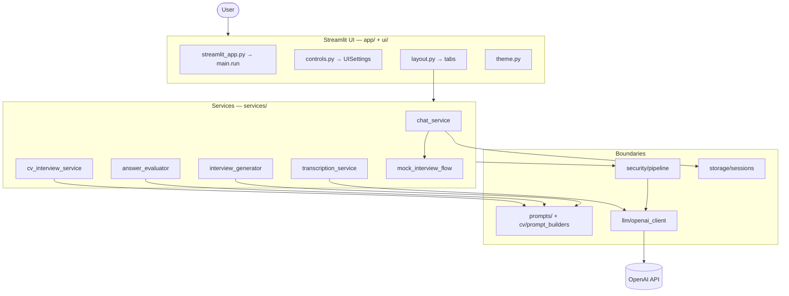
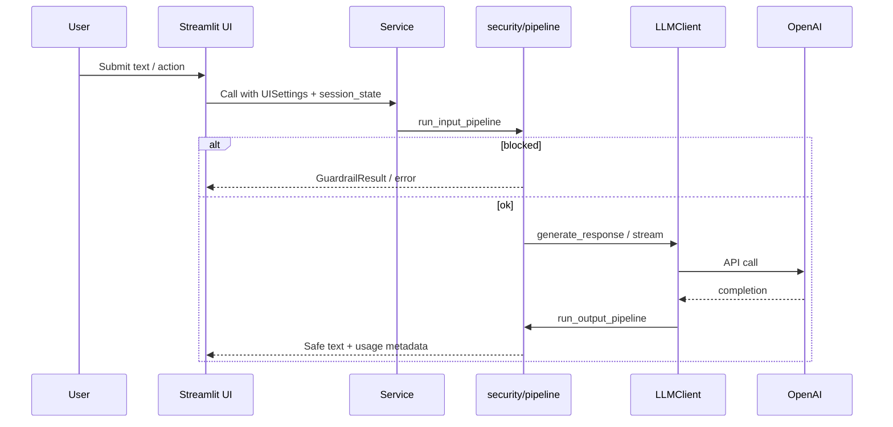
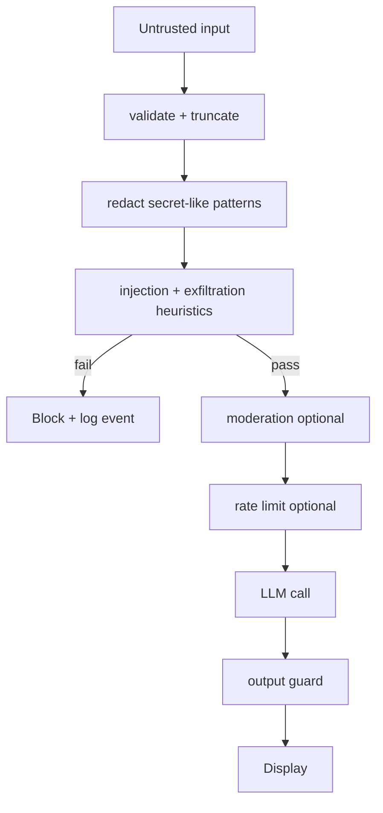
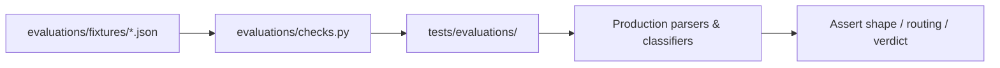
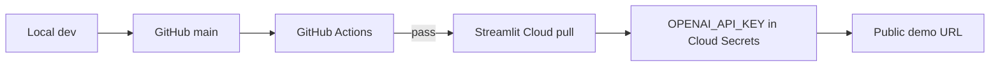

# Architecture

System design for the **AI Interview Preparation Assistant**—a Streamlit portfolio app with production-minded boundaries (guardrails, tests, CI) and intentional scope limits (no separate backend API or database in v1).

---

## 1. System overview

The app helps candidates practice interviews through four workspace tabs: **Mock Interview**, **Interview Questions**, **CV Interview Prep**, and **Feedback / Evaluation**. A sidebar configures role, seniority, model, prompt strategy, and usage mode (Demo vs BYO OpenAI key).

**Design goals**

- **Thin UI:** Streamlit orchestrates layout and `session_state`; services own prompts, guardrails, and API calls.
- **Single guardrail path:** User and file-derived text reaches the model through `security/pipeline.py` (or equivalent tested paths).
- **Inspectable prompts:** Composition lives in `prompts/` and `cv/prompt_builders.py`, not ad hoc UI strings.
- **Deterministic routing:** Mock-interview turn kinds and evaluation gating live in Python, not prompt-only logic.

---

## 2. Component responsibilities

| Component | Location | Responsibility |
|-----------|----------|----------------|
| **Entry** | `streamlit_app.py` | Add `src/` to `sys.path`, load optional `.env`, invoke `app.main.run()` |
| **App shell** | `app/main.py`, `layout.py`, `controls.py` | Page config, sidebar → `UISettings`, four workspace tabs |
| **Mock interview UI** | `app/tabs/mock_interview_tab.py` | Chat, streaming display, voice panel |
| **Voice UI** | `ui/voice_input.py` | Record/upload → auto-transcribe → edit → send |
| **Chat / routing** | `services/chat_service.py`, `mock_interview_flow.py` | Turn classification, LLM calls, evaluation triggers |
| **Questions** | `services/interview_generator.py` | Role-aware question generation; strategy comparison |
| **Feedback** | `services/answer_evaluator.py` | Structured markdown feedback parsing |
| **CV pipeline** | `services/cv_interview_service.py`, `cv/` | Upload, extract, generate, practice evaluation |
| **Transcription** | `services/transcription_service.py` | Whisper API; size limits; demo usage counting |
| **Security** | `security/` | Guards, pipeline, moderation, rate limit, output guard, logging |
| **LLM client** | `llm/openai_client.py` | SDK wrapper, retries, audit metadata (no prompt bodies in logs) |
| **Sessions** | `storage/sessions.py` | JSON files under `SESSIONS_DIR`; Demo vs BYO scoping |
| **Usage mode** | `app/usage_mode.py`, `ui/usage_mode_panel.py` | Demo cap, BYO session key, never persist BYO secret to disk |
| **Evaluations** | `evaluations/`, `tests/evaluations/` | Fixture-driven behavior checks without live OpenAI |

---

## 3. Why Streamlit was chosen

| Benefit | For this project |
|---------|------------------|
| **Speed to demo** | Single Python codebase, instant UI, easy Streamlit Cloud deploy |
| **Portfolio clarity** | Reviewers see product + code in one repo without frontend boilerplate |
| **Session state** | Natural fit for mock-interview chat and sidebar configuration |
| **Native widgets** | Tabs, chat, file upload, `audio_input` sufficient for MVP voice |

Streamlit is the right tradeoff for a **bootcamp/portfolio MVP**. It is not the long-term home for multi-tenant auth, custom mic UX, or heavy API traffic—that belongs in a dedicated backend (see Roadmap).

---

## 4. Why no database in this version

- **Scope:** Saved mock interviews are JSON files under `data/sessions/`—enough for demo and local review.
- **Deployment:** Streamlit Community Cloud has an ephemeral filesystem; sessions may not survive redeploys.
- **Complexity:** Postgres/Redis would require migrations, connection management, and auth—out of scope for v1.
- **Honesty:** The app does not claim durable multi-user storage.

Session IDs are validated against path traversal; Demo and BYO scopes use separate subdirectories.

---

## 5. Why no LangGraph / FastAPI / vector DB in this version

| Technology | Status | Reason |
|------------|--------|--------|
| **LangGraph** | Not used | Mock-interview FSM is small and testable in plain Python; no multi-agent graph needed |
| **FastAPI** | Not used | No public REST API; Streamlit calls services directly |
| **Redis** | Not used | Rate limits are in-process per Streamlit session |
| **Postgres** | Not used | JSON file sessions for MVP |
| **Qdrant / vector DB** | Not used | No RAG over document corpus; CV text is inlined per request |

These may appear in a future backend rewrite; they are **not** part of the current implementation.

---

## 6. Data flow

### Standard LLM request

### Mock interview turn routing

1. User message arrives with optional pending question.
2. `detect_mock_interview_turn_kind` / `detect_user_turn_type` classify the turn.
3. **Control / clarification / meta / off-topic:** conversational LLM path; **no** answer evaluation.
4. **Substantive answer** with pending question: `evaluate_answer` produces scored feedback and follow-up.
5. Usage metadata and optional session JSON updated.

### CV pipeline

1. Validate file size → extract text → sanitize delimiters.
2. LLM call #1: structured `CVStructuredExtraction` (JSON).
3. LLM call #2: full prep or practice questions (JSON).
4. Optional practice evaluation batch.

---

## 7. Security flow

Secrets-exfiltration coverage includes imperative requests for `st.secrets`, `.env`, environment variables, and app configuration values. Details: [security.md](security.md).

---

## 8. Evaluation flow

Evaluations use **mocked LLM output only**. CI runs them on every push without `OPENAI_API_KEY`.

---

## 9. Deployment flow

Alternative: `docker build` / `docker run` with `-e OPENAI_API_KEY=...` — see [DEPLOYMENT.md](DEPLOYMENT.md).

---

## 10. Tradeoffs and future improvements

| Current choice | Tradeoff | Future direction |
|----------------|----------|------------------|
| Streamlit monolith | Limited custom UX (voice, chat composer) | FastAPI + dedicated frontend or custom Streamlit components |
| JSON sessions | No cross-device sync | Postgres + user accounts |
| In-session rate limits | Not distributed | Redis-backed quotas |
| Heuristic guardrails | Bypassable by novel attacks | Optional LLM classifier, WAF, auth |
| Buffered structured outputs | Slightly higher latency on feedback tab | Stream only where UX benefits |
| Demo cap per session | Not per authenticated user | Auth + billing integration |

---

## Related documentation

- [security.md](security.md) — guardrails and threat model
- [testing.md](testing.md) — pytest and CI
- [STREAMLIT_CLOUD.md](STREAMLIT_CLOUD.md) — Cloud deployment
- [DEPLOYMENT.md](DEPLOYMENT.md) — Docker and other hosts
- [development.md](development.md) — conventions for extending the codebase
